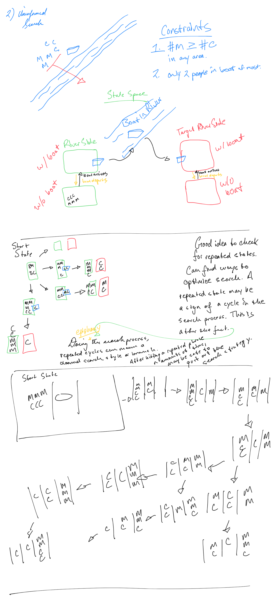

# Problem Set 2

Gagan Daroach

## 1. Intelligent Agents PEAS Descriptions

| Agent       | Playing tennis against a wall |
| ----------- | ----------------------------- |
| Performance | Succesfully hitting ball against the wall. |
| Environment | Court. Tennis Racket. Tennis ball. Wall.|
| Actuators   |  An arm to hold and swing the Tennis racket. A way for movement across court. |
| Sensors     | Cameras to watch ball. Pressure from arm to observe ball momentums and spin.  |

| Agent       | Playing a tennis match |
| ----------- | ----------------------------- |
| Performance | Winning the game, and scoring a point against the opponent.|
| Environment | Enemy player agent. Ball. Tennis court. Tennis racket. |
| Actuators   | An arm to hold and swing the Tennis racket. A way for movement across 2d court. |
| Sensors     | Cameras to watch ball. Pressure from arm to observe ball momentums and spin. |

| Agent       | Hospital Robot for dispensing medications to patients |
| ----------- | ----------------------------- |
| Performance | patient comfort, prescription dispensing accuracy. |
| Environment | Patients, Medications, Prescriptions. |
| Actuators   | Mechanics for dispensing into patient cup. |
| Sensors     | Camera for interpretting patient prescription information. |

| Agent       | Bidding on an item at an auction |
| ----------- | ----------------------------- |
| Performance | Number of item auctions won weighted against item cost. |
| Environment | Auction with item(s) and other bidding agents. |
| Actuators   | Ability to place bid on item. |
| Sensors     | Item's current max bidder. Item's current bid. |

| Agent       | Autonomous Mars Rover |
| ----------- | ----------------------------- |
| Performance |  Percentage of Mars surface explored. Count of new minerals and objects discovered and discomented. |
| Environment | Surface of Mars |
| Actuators   | Wheels to use to travel. Arm / Mineral Collector to observe and manipulate in the name of research. |
| Sensors     | Camera recording environment. Pressure feedback from arm and wrist grips. Altitude and GPS inputs for location tracking. |

## 2. Uninformed Search

### Why do people have a hard time solving this puzzle?

For me, I spent a large amount of time approaching the puzzle the wrong way. I think a lot of other people would think the same way. I first was trying to send two people at a time through the boat. After realizing how there was no solution with that path without killing my missionaries, I tried sending one person at a time. All through different combinations of orders I also ran a wall. Thinking about keeping a person on the boat is something that is not the inital way to think to get something done. The first instinct is to try to get everyone accross the river as fast as possible. This instinct is why people have a hard time. The idea of bringing someone back seems counterintuitive, so my brain ruled it out early on, actually not even considering it.

## 3. Informed Search and Exploration

